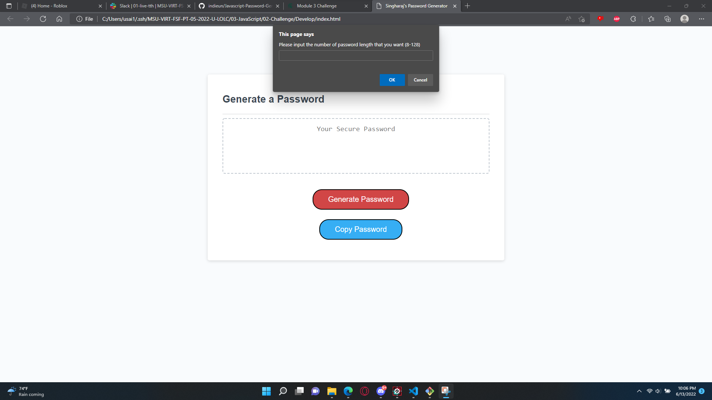
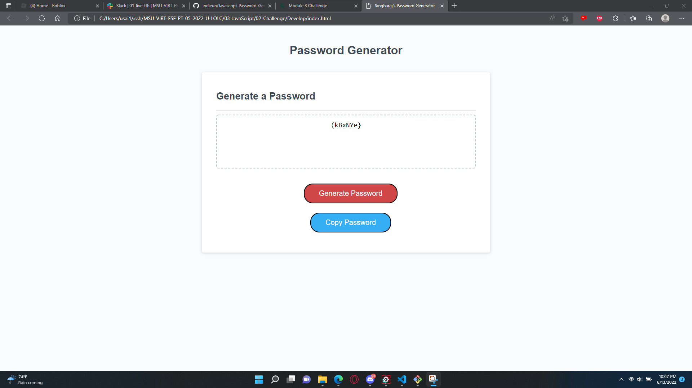
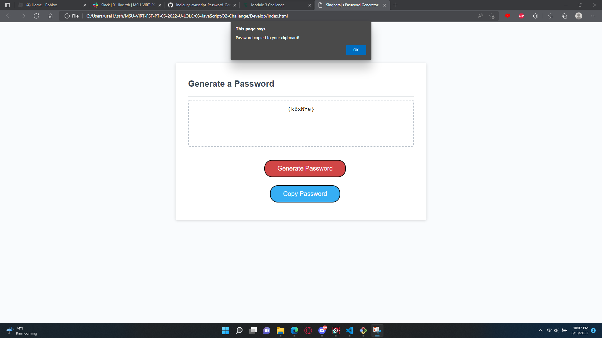

# JavaScript Password Generator

## Index
1. [Overview](#overview)
    - [Summary](#summary)
    - [Screenshots](#screenshots)
    - [Links](#links)
    - [Plans](#plans)
    - [Made with](#made-with)

# Overview

⚡ Modify an existing Javascript and add on to it in order to finish a password generator. 

## Summary

The purpose of this is to demonstrate a password generator when a user clicks on the red "Generate Password" button,
and a prompt is shown to the user to generate a password with the following:
The length of the password.
Choosing between 8 to 128 characters.
Do they want to include lowercase, uppercase, numbers, and special characters.
And after they have made their decisions, the password will be generated by Javascript's "Math.random() and Math.random()" functions, and finally their
generated password will be shown in the text box.

As an added bonus, there will also be a "Copy Password" button for user convenience. 

## Screenshots
*Generate Password Button
*You are shown the Generate Password button which creates randomly generated strings of characters.

*Prompts
*A list of prompts are given after clicking "Generate Passwords" as options for your choice of items you want in your generated password.

*Error message
*If you don't select valid options, you will be shown an error message saying that you must select a valid option.

*Password generated
*When all prompts are successfully chosen, your password is generated.

*Copy Password Button
*A convenient copy password button is present to copy the generated key into your clipboard.

## Links

Live Site URL: https://singharaj-usai.github.io/Javascript-Password-Generator

Repository URL: https://github.com/singharaj-usai/Javascript-Password-Generator

## Plans

I plan on converting this to use Tailwind CSS and make it look beautiful soon.

## Made With

* HTML5
* JavaScript
* CSS
